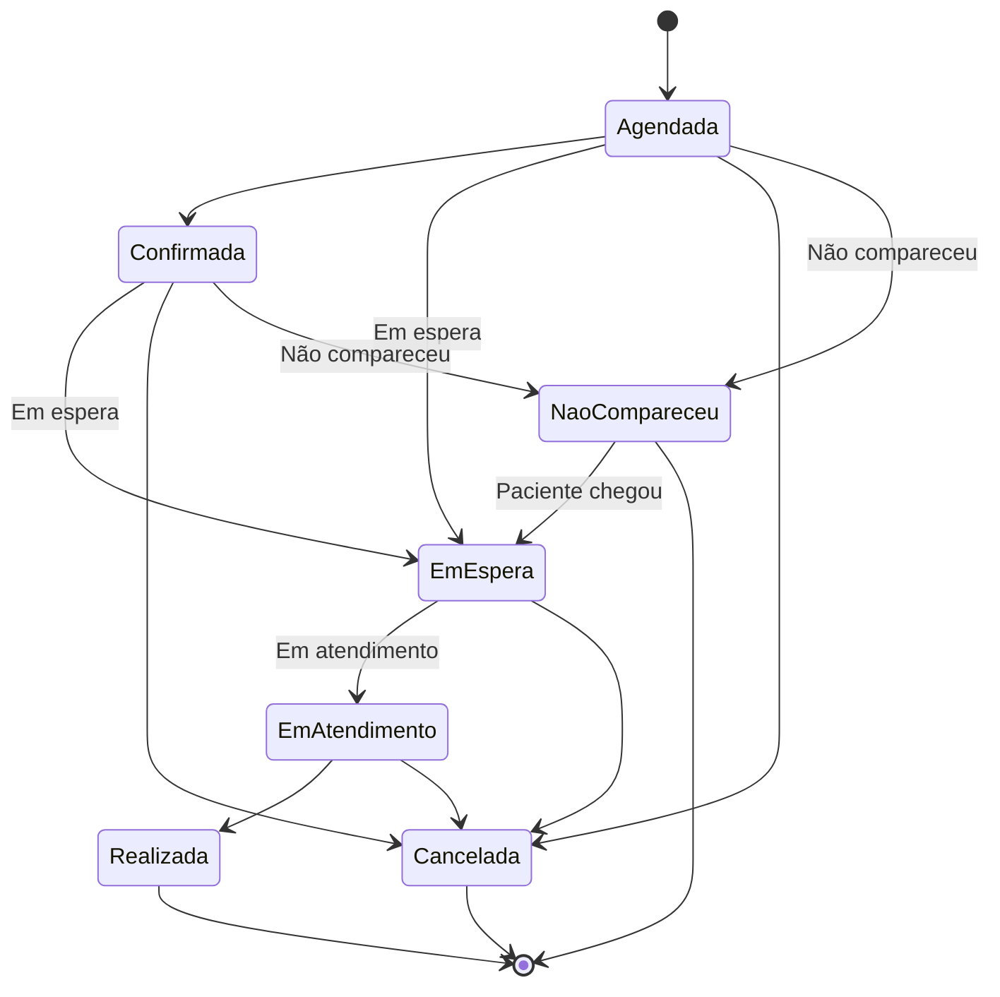
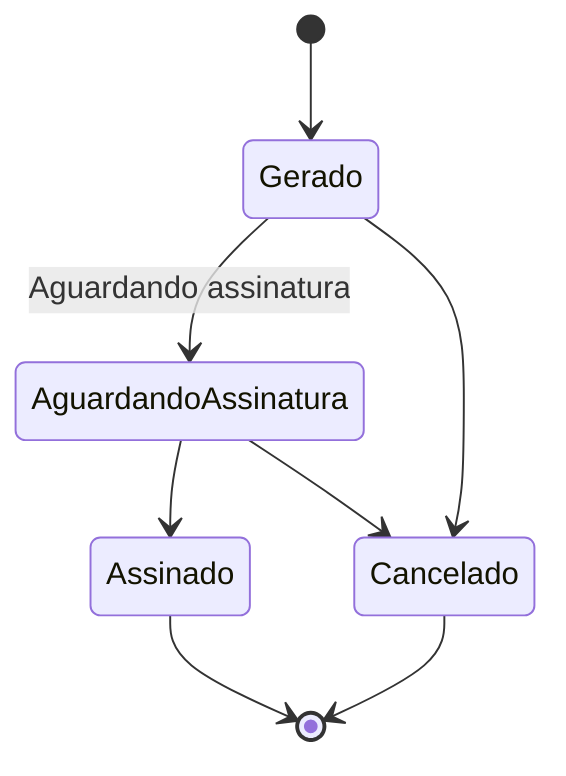
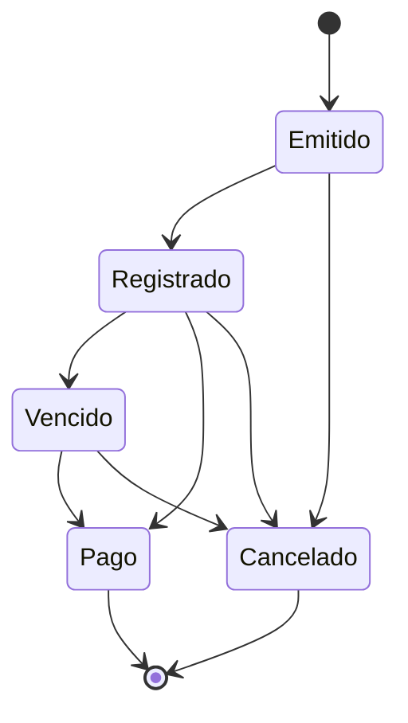

# Máquinas de Estado — Sistema de Clínicas Odontológicas

> Referência para validação de transições no backend e para as condicionais de UI (quais botões/ações aparecem conforme o status atual). Complementa a `matriz-permissoes.md`.

---

## Consulta (Appointment)

| Transição | Quem aciona | Precondições / observações |
|---|---|---|
| `[*] → Agendada` | Recepcionista / Gerente | Paciente sem débito/inadimplência; data não retroativa; dia/horário dentro do funcionamento da clínica; sem conflito de horário para o dentista ou paciente |
| `Agendada → Confirmada` | Recepcionista / Gerente | Contato prévio com o paciente (telefone/WhatsApp) confirmando presença |
| `Agendada → Em espera` | Recepcionista / Gerente | Check-in direto — paciente chegou sem confirmação prévia registrada (walk-in) |
| `Confirmada → Em espera` | Recepcionista / Gerente | Check-in do paciente que já havia sido confirmado previamente |
| `Em espera → Em atendimento` | **Dentista** (apenas o dentista responsável, chama o próprio paciente) | — |
| `Em atendimento → Realizada` | Dentista responsável (apenas o próprio) | Preenchimento completo dos dados pós-consulta (procedimentos, dentes, anamnese, diagnóstico etc.) |
| `Agendada / Confirmada / Em espera / Em atendimento → Cancelada` | Recepcionista / Gerente | Motivo do cancelamento obrigatório — permitido em qualquer estado, **inclusive durante o atendimento** (desistência do paciente), exceto após `Realizada` |
| `Agendada → Não compareceu` | Sistema (job agendado) | *Suposição a confirmar:* automático quando o horário agendado é ultrapassado em X minutos (tolerância configurável) sem check-in registrado — mesmo padrão do job `Boleto: Registrado → Vencido` |
| `Confirmada → Não compareceu` | Sistema (job agendado) | Mesma lógica acima — mesmo com confirmação prévia, se não houver check-in dentro da tolerância |
| `Não compareceu → Em espera` | Recepcionista / Gerente | Check-in manual quando o paciente chega atrasado, no mesmo dia, após já ter sido marcado como não compareceu |

**Regras gerais:**
- O status nunca regride — não existe transição de volta (`Realizada → Em atendimento`, `Cancelada → Agendada`, etc.), **com exceção pontual de `Não compareceu → Em espera`** (ver abaixo).
- `Cancelada` e `Não compareceu` são as exceções à progressão linear: `Cancelada` pode ser acionada a partir de **qualquer** estado anterior a `Realizada`; `Não compareceu` só é acionada a partir de `Agendada` ou `Confirmada`.
- `Realizada` é o único estado que bloqueia cancelamento — uma vez finalizada, a consulta não pode mais ser cancelada.
- Consulta com status `Realizada` só pode ser visualizada pela Recepcionista, nunca editada.
- O campo "Próxima consulta recomendada", preenchido na transição `Em atendimento → Realizada`, deve gerar uma sugestão automática de agendamento para a Recepcionista.
- `Confirmada` agora representa exclusivamente a confirmação prévia (contato antes do dia da consulta) — não deve ser confundida com o check-in físico (`Em espera`).
- `Não compareceu` é diferente de `Cancelada`: não exige motivo de cancelamento e não é contabilizado como cancelamento nos relatórios — entra na métrica separada de "taxa de no-show" (ver `MINI-WORLD.md`, dashboard do Gerente).
- Se o paciente chegar atrasado no mesmo dia após já ter sido marcado como `Não compareceu`, a Recepcionista/Gerente pode reabrir o atendimento movendo o status para `Em espera`, seguindo o fluxo normal a partir daí.
- Não é permitido cancelar uma consulta já marcada como `Não compareceu` — o estado é considerado um desfecho encerrado, a menos que seja reaberto para `Em espera`.

---

## Contrato

| Transição | Quem aciona | Precondições / observações |
|---|---|---|
| `[*] → Gerado` | **Apenas Gerente** | Vinculado a paciente + consulta + versão do template; snapshot dos dados do paciente é capturado nesse momento |
| `Gerado → Aguardando Assinatura` | Sistema / Gerente | Conteúdo pode ser editado enquanto estiver neste estado, antes da assinatura |
| `Gerado → Cancelado` | Apenas Gerente | Motivo do cancelamento |
| `Aguardando Assinatura → Assinado` | Assinatura digital do paciente | Estado final — não há transição de saída |
| `Aguardando Assinatura → Cancelado` | Apenas Gerente | Motivo do cancelamento |

**Regras gerais:**
- `Assinado` é terminal — contrato assinado não pode ser cancelado nem editado no sistema atual. Qualquer correção exige um novo contrato (nova versão do template + nova geração).
- Templates de contrato (criação/edição) são uma entidade separada do Contrato em si — apenas Gerente gerencia templates, e apenas Gerente gera um contrato para um paciente/consulta específico.

---

## Boleto

| Transição | Quem aciona | Precondições / observações |
|---|---|---|
| `[*] → Emitido` | Recepcionista / Gerente | Criado no sistema, ainda não confirmado pelo banco |
| `Emitido → Registrado` | Sistema (integração bancária — Sicredi) | Nosso número e linha digitável confirmados |
| `Registrado → Vencido` | Sistema (job agendado) | Automático, a partir da data de vencimento sem pagamento |
| `Registrado → Pago` / `Vencido → Pago` | **Webhook do banco (primário) + confirmação manual (fallback)** | Baixa manual disponível para Recepcionista/Gerente caso o webhook falhe ou atrase |
| `Emitido → Cancelado` / `Registrado → Cancelado` / `Vencido → Cancelado` | **Apenas Gerente** | — |

**Regras gerais:**
- `Pago` e `Cancelado` são estados finais.
- Toda transição automática (registro bancário, vencimento, webhook de pagamento) precisa ser refletida no `audit_log` mesmo sem ação manual de um usuário — registrar como "sistema" no campo de usuário responsável.
- A confirmação manual de pagamento (fallback) deve ficar visualmente marcada como diferente da confirmação automática, para rastreabilidade em caso de divergência com o banco depois.

---

## Resumo de decisões fechadas nesta rodada

| Decisão | Resultado |
|---|---|
| Estorno de pagamento | Apenas Gerente |
| Planos odontológicos (criar/editar/inativar) | Apenas Gerente |
| Dentista edita os próprios horários de disponibilidade | Não — apenas Recepcionista/Gerente |
| Confirmação de pagamento de boleto | Webhook (primário) + manual (fallback) |
| Cancelar boleto | Apenas Gerente |
| Gerar contrato para paciente/consulta | Apenas Gerente |
| Consulta: novo status "Em espera" e "Em atendimento" | Adicionados ao fluxo, entre Confirmada e Realizada |
| Consulta: pular Confirmada e ir direto para Em espera | Permitido (walk-in) |
| Consulta: quem aciona "Em atendimento" | Dentista chama o próprio paciente |
| Consulta: cancelamento após Em espera/Em atendimento | Permitido em qualquer estado, exceto após Realizada |
| Consulta: novo status "Não compareceu" (no-show) | Adicionado a partir de Agendada/Confirmada; **suposição a confirmar:** acionado automaticamente por job após tolerância sem check-in; pode voltar para Em espera se o paciente chegar atrasado |
